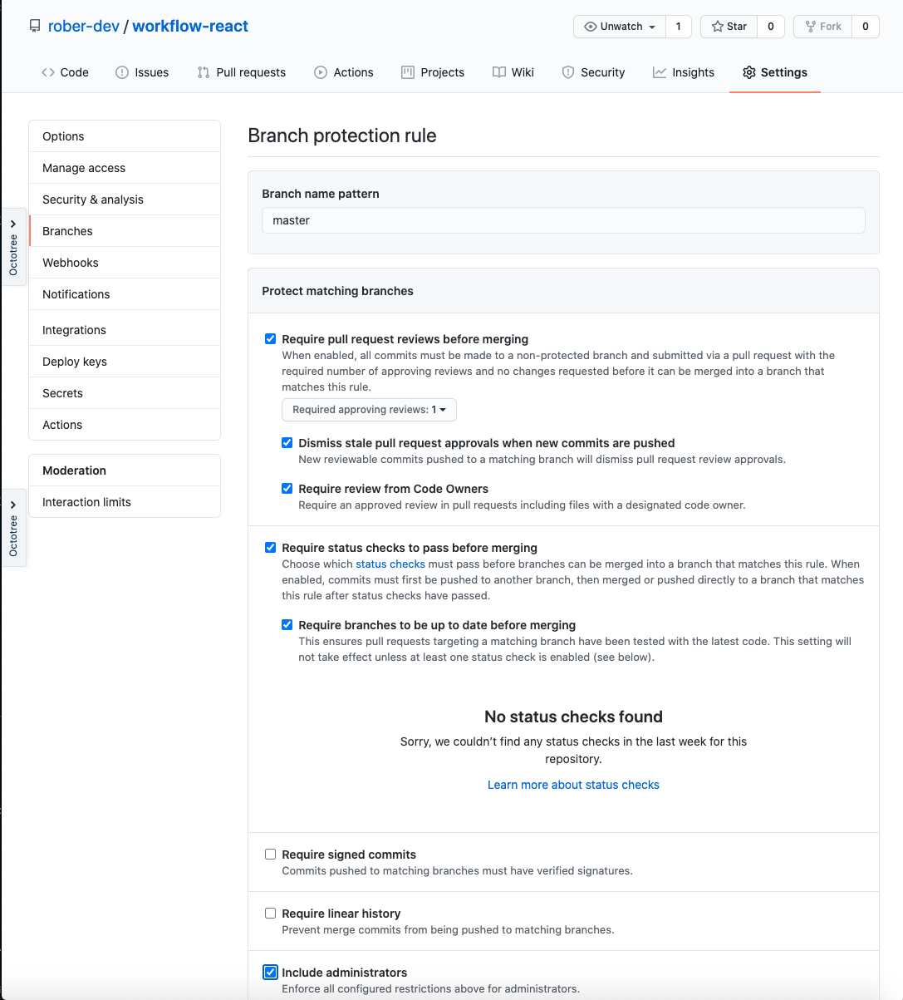

# 01 - CONFIGURAR REPOSITORIO

### 1. Crear repository en Github

### 2. Crear la carpeta .github/workflows en la raíz del proyecto

### 3. Añadir el archivo .github/CODEOWNERS

Por ejemplo:

```txt
* @{github-username}
*.js  @{github-username}
/src/moduleX/ @{github-username}
```

### 4. Asignarlo al proyecto

```bash
git remote add origin https://github.com/{author}/{project-name}.git
git push -u origin master
```

### 5. Crear rama **develop** en github

### 6. Proteger la ramas **master** y **develop**

Github project > Settings > Branches > Branch protection rules > Add rule

Establecer los siguientes valores para cada una de las ramas (master y develop)


